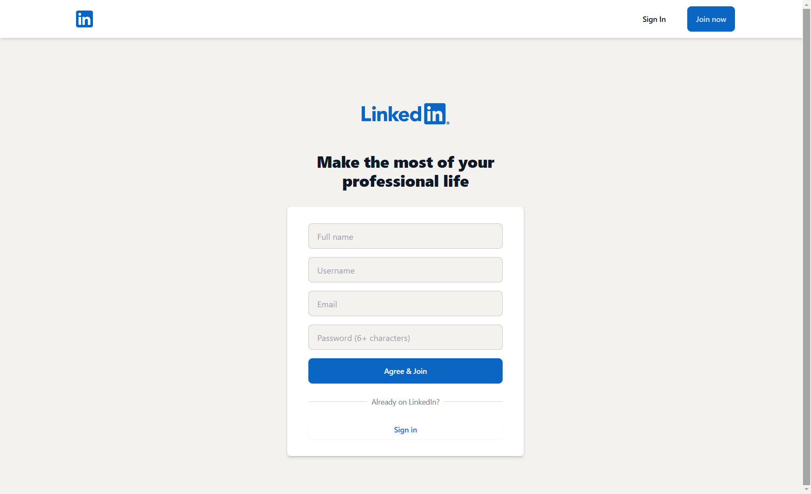
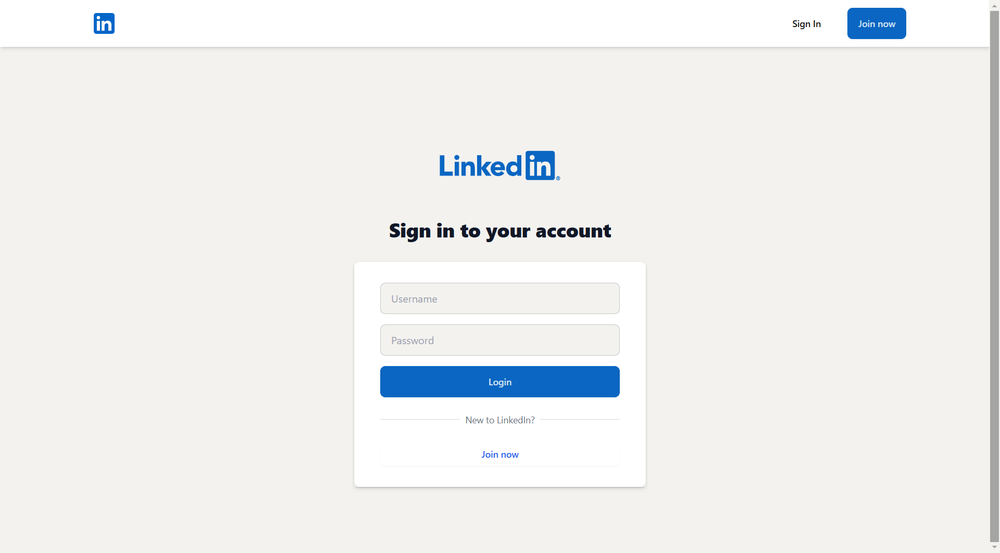
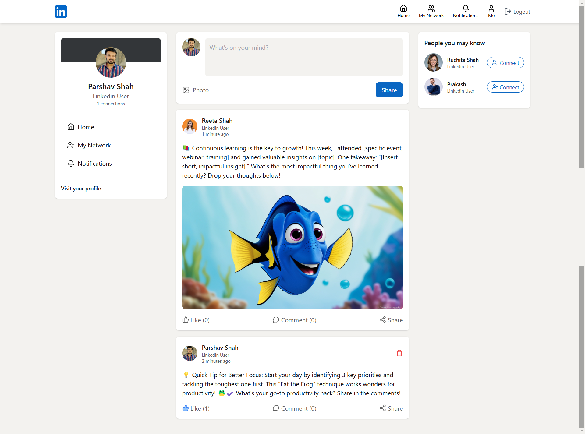
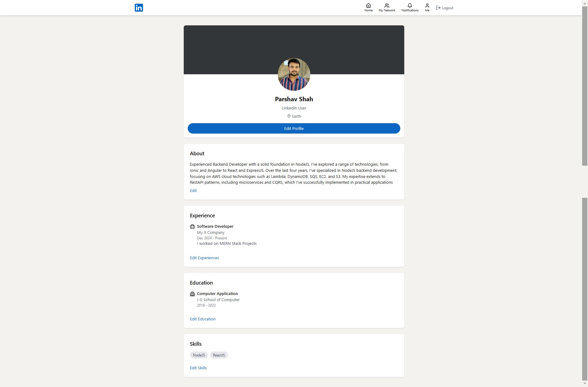
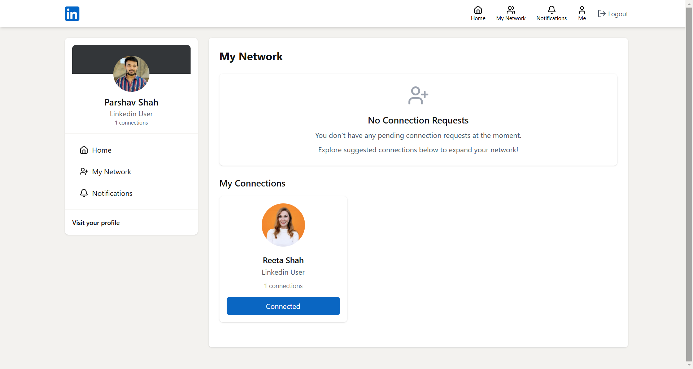
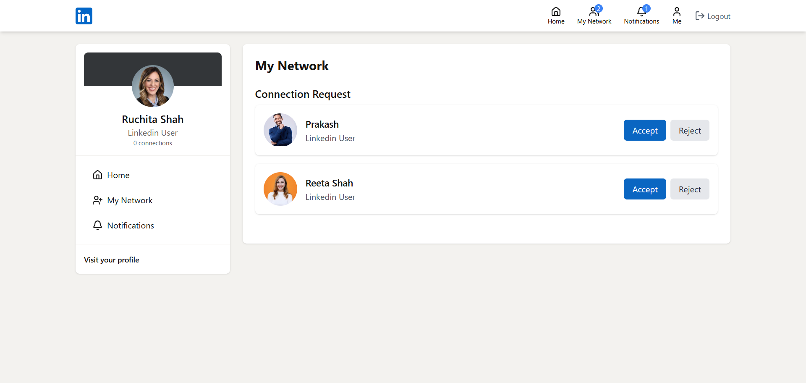
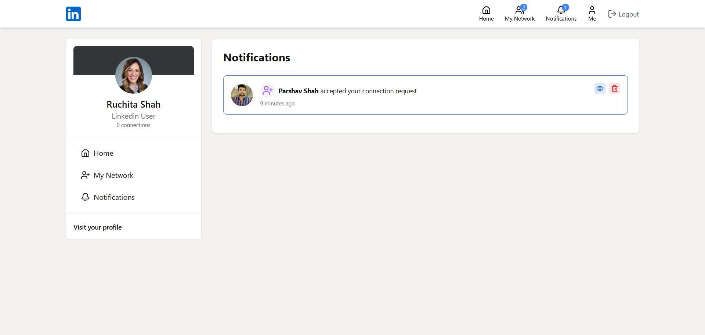

# LinkedIn Clone Application with MERN Stack

A full-stack LinkedIn clone built using the MERN stack (MongoDB, Express.js, React.js, Node.js). This project replicates the core features of LinkedIn, including user authentication, profile management, connections, posts, and notification.

## Features

- **User Authentication:** Sign up, login, and logout with secure password hashing.
- **Profile Management:** Create and edit profiles with details like bio, skills, and work experience.
- **Connections:** Connect with other users and manage your professional network.
- **Posts and Feeds:** Create, like, comment, and view posts in a real-time feed.
- **Notification:** Real-time notification functionality for connecting with other users.

### Frontend
- **React.js**: A JavaScript library for building user interfaces.
- **Tailwind-CSS**: For a professional, responsive UI design.

### Backend
- **Node.js**: JavaScript runtime for server-side development.
- **Express.js**: Web framework for building APIs.

### Database
- **MongoDB**: NoSQL database to store user data, posts, and messages.

### Additional Tools
- **JWT (JSON Web Tokens)**: For user authentication and authorization.
- **Cloudinary**: To upload and manage profile pictures and post images.
- **dotenv**: To manage environment variables.

## Installation and Setup

### Prerequisites
Make sure you have the following installed:
- Node.js (v14 or later)
- MongoDB (local or cloud instance)
- npm or yarn

### Screenshots

